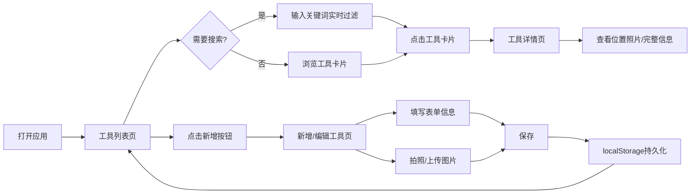

## 1. 产品概述

家庭工具管理系统是一款帮助用户系统化管理家中各类工具（螺丝刀、扳手、电钻、梯子、胶带等）的Web应用。解决家庭工具存放位置遗忘、数量不清、维护提醒缺失等痛点问题。

- 目标用户：家庭用户、DIY爱好者、需要管理家中工具的任何人
- 产品价值：让工具随手可得，通过拍照+位置记录实现秒级定位，再也不会找不到工具

## 2. 核心功能

### 2.1 功能模块

1. **工具列表页（首页）**：顶部搜索栏、工具卡片网格、分类筛选、统计概览
2. **新增/编辑工具页**：表单录入工具信息、拍照上传、位置描述
3. **工具详情页**：完整信息展示、大图预览、位置地图标记、维护提醒
4. **数据持久化**：本地存储（localStorage）、图片压缩优化

### 2.3 页面详情

| 页面名称 | 模块名称 | 功能描述 |
|-----------|-------------|---------------------|
| 工具列表页 | 顶部搜索栏 | 实时模糊搜索工具名称、存放位置 |
| 工具列表页 | 分类筛选 | 按工具类型（手动工具/电动工具/耗材/其他）筛选 |
| 工具列表页 | 统计概览 | 显示工具总数、需充电工具数、各类别数量 |
| 工具列表页 | 工具卡片网格 | 卡片展示缩略图、名称、位置、数量、状态标签 |
| 新增/编辑工具页 | 表单模块 | 名称、类型、存放位置、数量、购买日期、是否需充电/换电池、备注 |
| 新增/编辑工具页 | 拍照模块 | 调用摄像头拍照或从文件选择，支持多图，自动压缩 |
| 工具详情页 | 信息展示 | 完整字段展示、大图轮播、维护状态高亮提醒 |

## 3. 核心流程

### 3.1 主要用户流程

用户打开应用 → 查看工具列表/搜索工具 → 点击工具卡片查看详情/位置照片 → 需要添加工具时点击"新增"按钮 → 填写表单并拍照 → 保存后自动返回列表。

### 3.2 流程图

## 4. 用户界面设计

### 4.1 设计风格

- **设计主题**：工业实用主义（Industrial Utility）风格，木质纹理背景搭配金属质感控件，营造工具箱的氛围
- **主色调**：深木色 `#4A3728` 作为背景基调，安全橙 `#FF6B35` 作为主强调色，钢铁灰 `#6B7280` 作为辅助色
- **次色调**：米白色 `#F5F0E8` 卡片背景，绿色 `#10B981` 标记正常状态，红色 `#EF4444` 标记需充电提醒
- **按钮风格**：圆角8px，带微妙阴影，hover时有上浮效果，主按钮使用渐变橙
- **字体**：标题使用 "ZCOOL KuaiLe"（中文手写风格，有力量感），正文使用 "Noto Sans SC"（清晰易读）
- **布局风格**：卡片式网格布局，每张卡片模拟工具箱抽屉的视觉效果，带轻微立体感
- **图标风格**：使用 emoji + 线性图标混合，工具卡片用 emoji 快速识别（🔧🪛🔨⚡）

### 4.2 页面设计概述

| 页面名称 | 模块名称 | UI元素 |
|-----------|-------------|-------------|
| 工具列表页 | 顶部导航 | 木质纹理顶栏，左侧应用Logo（🧰 家庭工具箱），右侧新增按钮（+） |
| 工具列表页 | 搜索区域 | 圆角搜索框带放大镜图标，下方分类标签切换（全部/手动/电动/耗材/其他） |
| 工具列表页 | 统计条 | 4个小方块显示：工具总数、需充电数、存放位置数、本月新增 |
| 工具列表页 | 卡片网格 | 3列网格，卡片有边框+阴影，左上角工具类型emoji，右上角数量角标，底部位置文字，卡片右下角状态圆点（绿/红） |
| 新增/编辑工具页 | 表单容器 | 白色卡片带圆角，分块：基本信息/位置信息/维护信息/照片区域 |
| 新增/编辑工具页 | 拍照区域 | 大虚线框，内有📷图标和文字，点击后可选拍照或文件，缩略图排列带删除按钮 |
| 工具详情页 | 顶部 | 返回按钮 + 编辑/删除操作按钮，大图轮播区域 |
| 工具详情页 | 信息区 | 两列布局：左侧信息字段列表，右侧位置照片放大显示 |

### 4.3 响应式

- **桌面优先**：默认3列卡片网格（≥1024px）
- **平板适配**：2列网格（768px-1023px）
- **手机适配**：单列网格（<768px），底部悬浮新增按钮，顶部搜索固定
- 触摸优化：按钮最小高度44px，卡片点击区域充足

