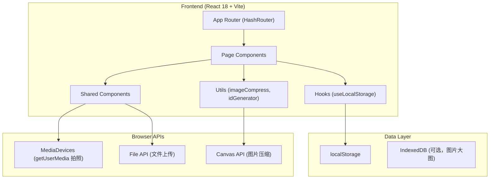
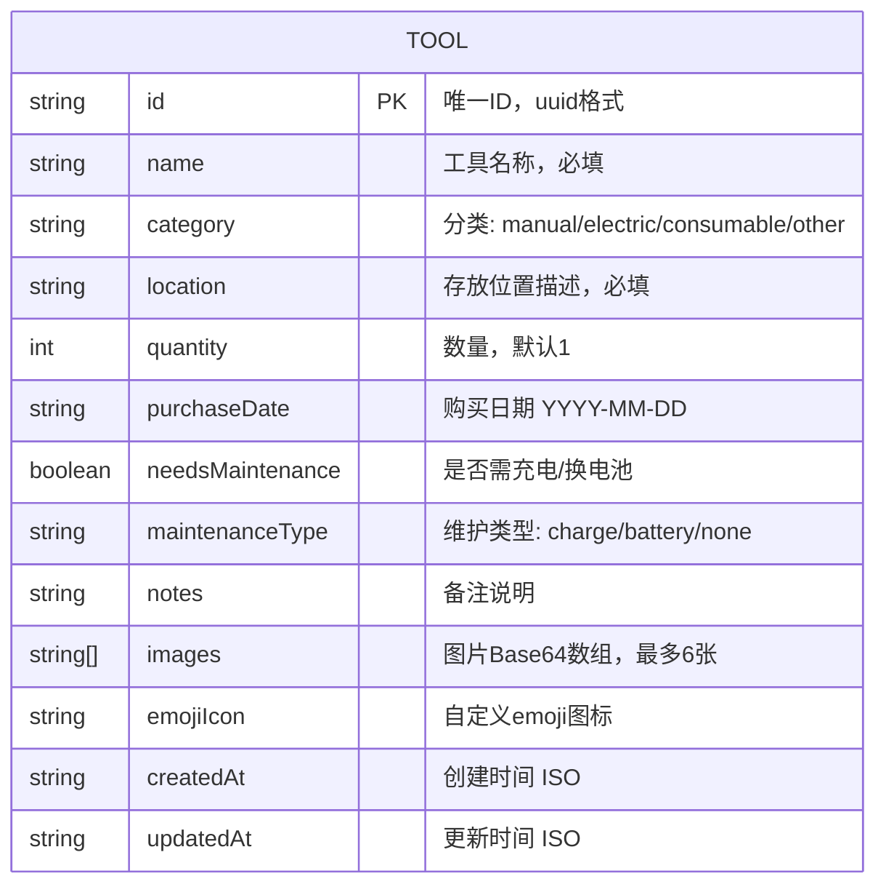

## 1. 架构设计



## 2. 技术描述

- **前端框架**：React@18 + TypeScript
- **初始化工具**：Vite@5
- **样式方案**：Tailwind CSS@3 + CSS Variables（主题系统）
- **路由管理**：React Router DOM@6（HashRouter，兼容本地文件打开）
- **状态管理**：React Hooks (useState, useEffect, useContext) + useLocalStorage 自定义Hook
- **图标方案**：React Icons (Lucide风格) + emoji混合使用
- **后端**：无后端，纯前端方案
- **数据库**：localStorage（元数据）+ Base64 DataURL（缩略图存储）
- **图片处理**：Canvas API 原生压缩（最大尺寸800px，质量0.8）

## 3. 路由定义

| 路由 | 页面组件 | 用途 |
|-------|---------|------|
| `/` | ToolListPage | 工具列表首页（搜索+筛选+卡片网格+统计） |
| `/tool/new` | ToolFormPage | 新增工具表单页 |
| `/tool/:id/edit` | ToolFormPage | 编辑工具表单页 |
| `/tool/:id` | ToolDetailPage | 工具详情页（大图+完整信息） |

## 4. 数据模型

### 4.1 数据模型定义（ER图）



### 4.2 TypeScript 类型定义

```typescript
type ToolCategory = 'manual' | 'electric' | 'consumable' | 'other';
type MaintenanceType = 'charge' | 'battery' | 'none';

interface Tool {
  id: string;
  name: string;
  category: ToolCategory;
  location: string;
  quantity: number;
  purchaseDate: string;
  needsMaintenance: boolean;
  maintenanceType: MaintenanceType;
  notes: string;
  images: string[];
  emojiIcon: string;
  createdAt: string;
  updatedAt: string;
}

interface ToolStore {
  tools: Tool[];
  lastSync: string;
}
```

### 4.3 localStorage 存储键

- 键名：`family_toolbox_data`
- 初始Mock数据：首次打开时若为空，自动注入8条示例工具（螺丝刀、扳手、电钻等各一条）

## 5. 组件结构

```
src/
├── components/
│   ├── layout/
│   │   ├── Header.tsx         # 顶部导航栏
│   │   └── StatsBar.tsx       # 统计概览条
│   ├── tool/
│   │   ├── ToolCard.tsx       # 工具卡片组件
│   │   ├── ToolGrid.tsx       # 卡片网格容器
│   │   ├── ToolSearch.tsx     # 搜索+筛选组件
│   │   ├── ToolForm.tsx       # 表单组件（新增/编辑共用）
│   │   ├── ImageUploader.tsx  # 拍照/上传图片组件
│   │   └── ImageCarousel.tsx  # 详情页大图轮播
│   └── ui/
│       ├── Button.tsx         # 按钮组件
│       ├── Input.tsx          # 输入框组件
│       ├── Badge.tsx          # 状态标签组件
│       └── Modal.tsx          # 通用弹窗
├── pages/
│   ├── ToolListPage.tsx       # 列表页
│   ├── ToolFormPage.tsx       # 表单页
│   └── ToolDetailPage.tsx     # 详情页
├── hooks/
│   ├── useLocalStorage.ts     # 本地存储Hook
│   └── useToolStore.ts        # 工具数据管理Hook
├── utils/
│   ├── image.ts               # 图片压缩/处理工具
│   ├── id.ts                  # ID生成器
│   └── mockData.ts            # 初始化Mock数据
├── types/
│   └── index.ts               # 全局类型定义
├── context/
│   └── ToolContext.tsx        # 全局数据Context
├── App.tsx
├── main.tsx
└── index.css                  # Tailwind + 自定义主题
```

## 6. 图片压缩策略

1. **文件上传流程**：用户选择文件/拍照 → FileReader读取 → 创建Image对象 → Canvas等比缩放（最大边800px）→ toDataURL('image/jpeg', 0.8) → 存入Tool.images数组
2. **拍照功能**：`<video>` + `getUserMedia` + Canvas截图，直接压缩后输出
3. **存储上限**：单张图片压缩后约50-150KB，localStorage总容量限制约5MB，支持20-50+个带图片的工具记录
4. **渐进降级**：如localStorage报QuotaExceededError，提示用户移除部分图片或仅存第一张

